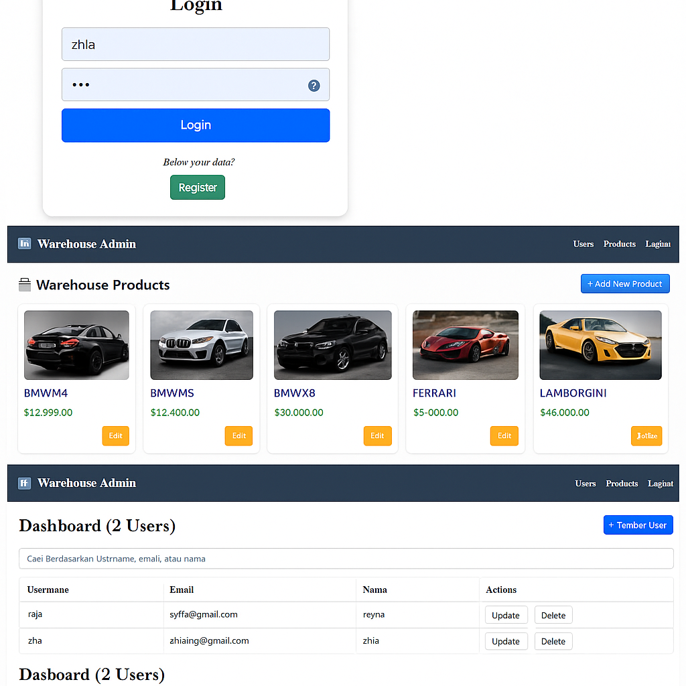

# 🚗 Warehouse Admin

Aplikasi **Warehouse Admin** adalah sistem manajemen gudang berbasis web yang memungkinkan pengguna untuk mengelola data produk (mobil) dan pengguna (users) melalui antarmuka admin yang sederhana dan interaktif.

## 🧰 Fitur Utama

### 🔐 Autentikasi Pengguna
- Login dan registrasi pengguna
- Proteksi halaman berdasarkan status login

### 🧾 Manajemen Produk
- Menampilkan daftar mobil lengkap dengan gambar, nama, dan harga
- Tambah produk baru
- Edit dan hapus produk

### 👥 Manajemen Pengguna
- Tampilkan seluruh pengguna
- Update dan hapus data pengguna
- Fitur pencarian berdasarkan username, email, atau nama

## 🖼️ Tampilan Antarmuka
 <!-- Ganti dengan path gambar gabungan jika sudah tersedia di repo -->

## 🏗️ Teknologi yang Digunakan
- **Frontend**: HTML, CSS (Tailwind/Bootstrap jika digunakan)
- **Backend**: Node.js / Express / Laravel / Django *(disesuaikan dengan teknologi yang sebenarnya digunakan)*
- **Database**: MySQL / MongoDB / PostgreSQL *(disesuaikan)*

## ⚙️ Cara Menjalankan

1. Clone repository:
   ```bash
   git clone https://github.com/username/warehouse-admin.git
   cd warehouse-admin
